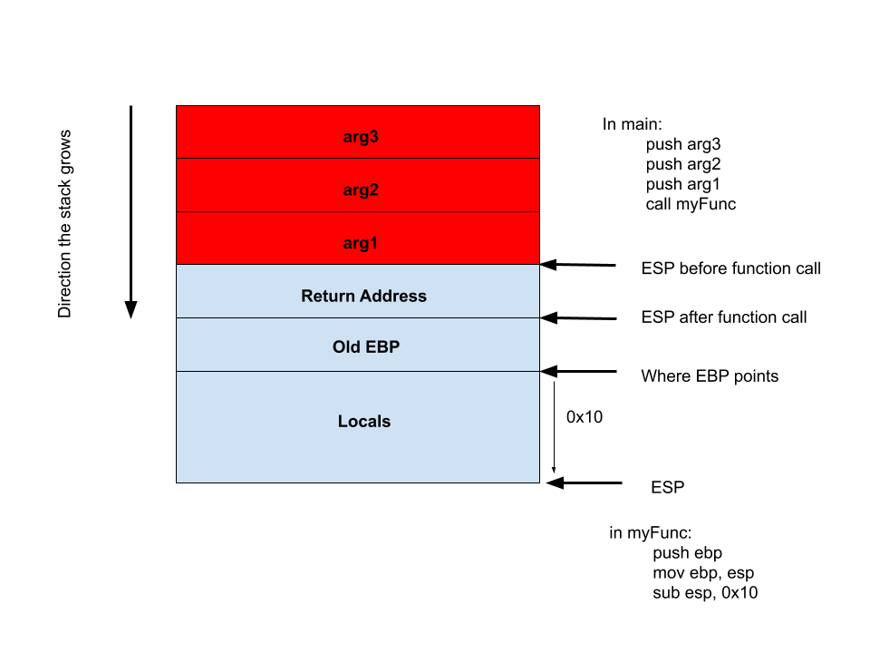

# Buffer Overflows and Memory Alteration

## Overview 
Buffer Overflows are a common vulnerability. We will discuss how to exploit a buffer overflow to alter memory on the stack, changing variable values and return addresses in order to control the flow of execution in a program. 

## Program to Explore the stack
[stackframe.c](examples/stackframe.c) 
[stackframe](examples/stackframe) 

## Vulnerable Program
[stackframe_vuln.c](examples/stackframe_vuln.c) 
[stackframe_vuln](examples/stackframe_vuln) 

