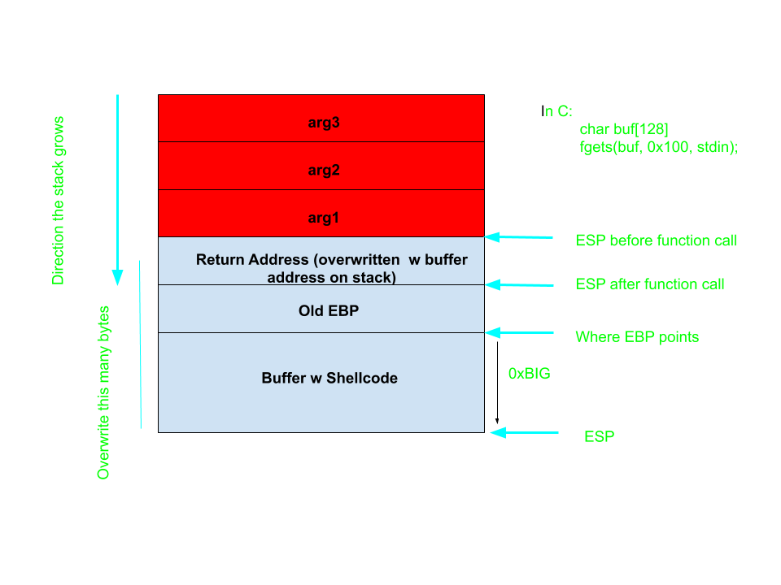
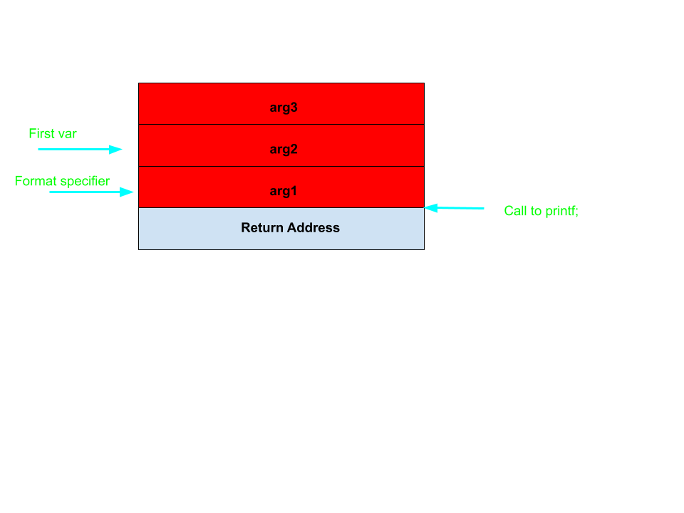

# Shellcode and Linux System Calls 

## What is Shellcode?
Shellcode is machine level code that can be executed on a computer at runtime. Shellcode gets its name from being a payload that can generate a shell, but we can use shellcode read, create, and delete files. In yesterday's example, we had a `win` function, but in the real world we don't usually have a win function. 

## Running Shellcode in C
We are going to take some premade shellcode, and run it in a C program. 
<script src="https://gist.github.com/LandonJones/a06da2293db7637dccaaebd55d221048.js"></script>

## Writing Shellcode by Hand
We haven't looked at writing assembly at all so far in this course, but many times you can't use premade shellcode because of input restrictions (certain characters can't be used, certain calls can't be made by a program, or there is a size limit). 

To develop our own assembly programs, we will use `nasm` and `ld` to turn our compiled assembly programs into executables. For example if we had assembly in `hello.asm` we could compile and execute it using

```shell
nasm elf -f hello.asm #creates an object file hello.o 
ld -m elf_i386 -s -o hello hello.o #links the object file to create the executable
./hello
```  

```assembly
section .text: 
	global _start ;;tells the linker where start is

_start: 
	sub esp, 0x10 ;; make room on the stack for "Hello, World!"
	mov dword [esp], 0x6c6c6548 ;; push 'Hell' in little-endian
	mov dword [esp + 4], 0x57202c6f ;;push 'o, W' 
	mov dword [esp + 8], 0x646c726f ;;push 'orld'
	mov dword [esp + 12], 0x00000a21 ;;push '!'
	mov ebx, 1 ;; the file descript, stdout in this case
	mov ecx, esp ;; address to read from
	mov edx, 14  ;; len of message
	mov eax, 4 ;; sys_call number, 4 is write
	int 0x80 ;; call to kernel
	
	mov eax, 1 ;; sys_call number (exit) 
	int 0x80 ;; call to kernel
```

## What are those int 0x80 calls?? 
An `int` in assembly is an interrupt and the `0x80` refers to the linux kernel. Other system calls we can perform are `open`, `read`, `write`, and `exec`. One thing to notice is that arguments are passed differently to system calls than normal functions in x86. Normally these arguments are passed via the stack, but in system calls they are passed via the general purpose registers. 

## Turning Assembly into Shellcode  
If we have a compiled executable, we can convert it's output to shellcode with 
```shell 
objdump -D hello |grep '[0-9a-f]:'|grep -v 'file'|cut -f2 -d:|cut -f1-6 -d' '|tr -s ' '|tr '\t' ' '|sed 's/ $//g'|sed 's/ /\\x/g'|paste -d '' -s |sed 's/^/"/'|sed 's/$/"/g'
```
If there are any `\x00`'s in your output, rewriting your assembly is necessary to remove them. Strings are null-terminated in C, so your string will no longer be read after the null-byte. One strategy is to not use full registers for full operations. Let's do that with the `Hello World` from above. 

```assembly
section .text: 
	global _start ;;tells the linker where start is

_start: 
	sub esp, 0x10 ;; make room on the stack for "Hello, World!"
	mov dword [esp], 0x6c6c6548 ;; push 'Hell' in little-endian
	mov dword [esp + 4], 0x57202c6f ;;push 'o, W' 
	mov dword [esp + 8], 0x646c726f ;;push 'orld'
	mov dword [esp + 12], 0x0a21 ;;push '!\n'
	mov bl, 1 ;; the file descriptor, stdout in this case
	mov ecx, esp ;; address to read from
	mov dl, 14  ;; len of message
	mov al, 4 ;; sys_call number 
	int 0x80 ;; call to kernel
	
	mov al, 1 ;; sys_call number (exit) 
	int 0x80 ;; call to kernel 
```
Now our shellcode looks like: 
`"\x83\xec\x10\xc7\x04\x24\x48\x65\x6c\xc7\x44\x24\x04\x6f\x2c\x57\xc7\x44\x24\x08\x6f\x72\x64\x66\xc7\x44\x24\x0c\x21\xb3\x01\x89\xe1\xb2\x0e\xb0\x04\xcd\x80\xb0\x01\xcd\x80"` 

## Using pwntools for Shellcode
The pwntools library has a shellcraft module that is really useful. 
To get shellcode that runs `/bin/bash` we can run 

```python 
from pwn import * 
shellcode = asm(pwnlib.shellcraft.i386.linux.sh())
```
## Exploiting a Buffer Overflow with Shellcode
Injecting shellcode and getting it run by the binary is done by: 
1. Injecting the shellcode into a buffer.
2. Overwriting the return address to a value on the stack, either at the start of the buffer, or somewhere within the buffer. 

This is fairly easy if we have a large space to write to, and we have the address of our buffer. 

 

Let's try this challenge: 
[main](examples/pwn1)
`nc 52.15.140.126 5003` 

## What happens if we aren't given the buffer address? 
Chances are, the binary will still be compiled with ASLR, but we might be able to leak the address of the binary with another attack, like a format string vulnerability. 

## Format String Attack
Common Format String Commands



[echooo](examples/echooo) 


