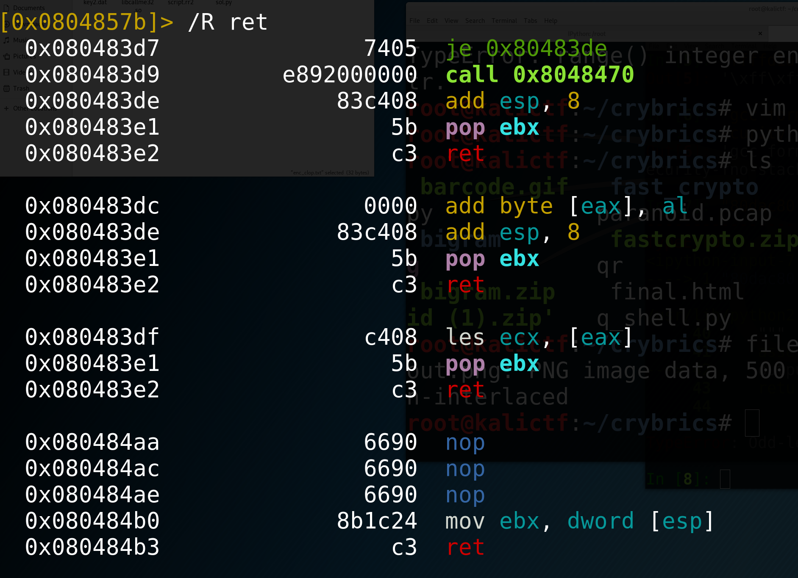
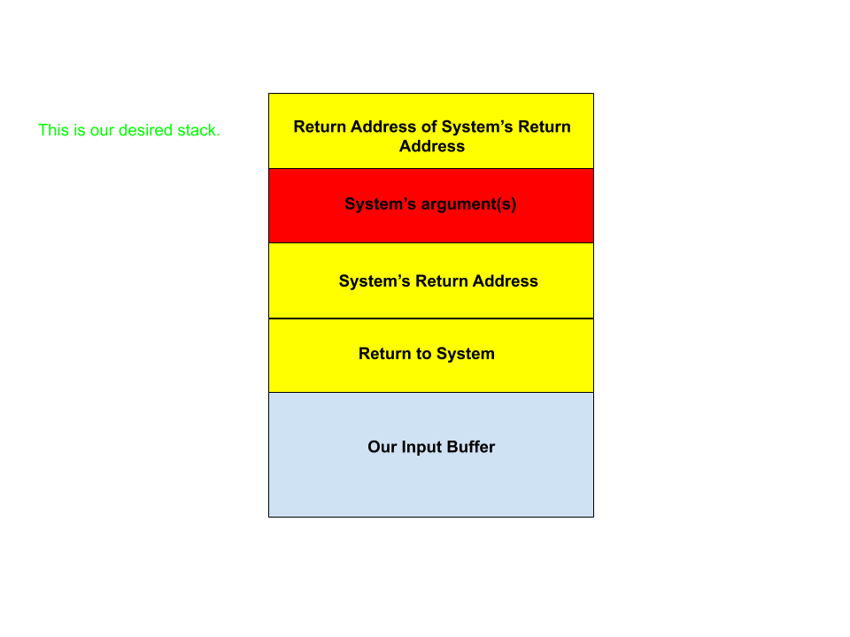

# Return Oriented Programming and Automating Exploit Scripts

## Overview
We have learned how to use buffer overflows to return to win functions, and even our own shellcode, but these exploitation techniques only work in certain conditions (whether a `win` function exists and, in the case of shellcode, execstack has to be enabled). Return-oriented programming allows us to build a custom win function by piecing together segments of code in the executable. 

## Setting Up Good Exploitation Development Practices in Radare2 and pwntools
In order to properly pwn, we need to get more acquainted with the tools we're using to pwn. So, let's take some time to exploit a ret2win vulnerability using Radare2 and pwntools. 

### Part 1: Exploration and Vulnerability Discovery
Here I'll list various ways you can explore your binary that should help lead to the vulnerability discovery. 

First, we should run `checksec` / `rabin2 -I <binary>` to get some information about our binary including whether the stack is executable, if PIE (Position Independent Execution) is present, or if a Canary is present. `checksec` is a command line tool that is installed if you have pwntools. 

If `NX` is disabled, we might have a shellcode vulnerability. Otherwise, if there is no Canary, it could be a simple buffer overflow or ROP, or maybe it's not a stack-based exploit at all. But, the output of `checksec` will give us an idea of what we're looking for in the binary. 

We can also run other `rabin2` commands. `rabin2 -z <binary>` will list strings and their memory addresses in the program. This can also help us determine what vulnerability we might be looking at. 

Next we open, `ret2win` in radare2 using `r2 -Ad ret2win`. 

### Part 2: Exploit Development
There are two important steps in the development of our exploit. 
1. Creating the payload (we will use `pwntools` on the local binary for this) 
2. Debugging the payload (we will use `rarun2` with our payload for this) 

#### Creating the Payload 
So, exploration told us this is a buffer overflow attack. We are reading 50 bytes from the user, and there's only 32 bytes of memory allocated on the stack. The goal is to overwrite the return address to our `win` function, so we need to know two things: what's the return address of the `win` function, and how far is our input from the current return address.  

1. Finding the return address of our win function. 
We can do this from the command line with `rabin2 -s ret2win32 | grep ret2win`. This gives us this output. 

And here is our function address. 

Suppose you were already in radare2 and seeked to the function. Running `afi` in command mode will give you some information about the current function including the address of the function under `offset`. 

2. Finding the offset of our input to the return address. 
We can use pwntools to run our binary in python, generate our debrujin sequence, and send it to the binary like this. 

```python 
from pwn import * 

r = process('./ret2win32') 

print(r.recv()) 
payload = cyclic(150) 
r.sendline(payload) 
#python will give you a response that the connection was closed because we segfaulted
```


Now, in the terminal, we can type `dmesg | tail -1`, which will give us some info about our segfault including what the instruction pointer was set at. The value in the instruction pointer is the return address to the function that we overwrote. So we can throw that into python like 

```python 
from pwn import * 
cyclic_find([instruction-pointer-value-here]) 
#it returns the exact offset we need 
``` 
So now our payload looks like `'A'*offset + p32(return_address)`. 

We can send this in python to our binary to check our solution! 

But what if we were wrong? How can we debug our solution? Radare2 to the rescue! 

Along with `rabin2`, radare2 comes with `rarun2` which lets us specify the running environment of radare2, so we can alter `stdin` to be from a file. This is nice because most of our payloads are not printable characters. 

```rr2
#!/usr/bin/rarun2 
stdin=in.bin
``` 
Now write your python output to `in.bin` like 
```python 
###Assuming payload already has your payload
with open('in.bin', 'w') as f:
     f.write(payload)
``` 
And now we run radare2 with new arguments to get our stdin from the file.

`r2 -r script.rr2 -Ad ret2win` 

Now we can debug our payload with all of the debugging options in radare2! 

Basic Debugger commands: 
* db address-here : sets a breakpoint 
* db : lists all break points 
* px n @register + offset : prints n bytes of hex of register + offset  
* ps n @register + offset : prints n bytes of strings 

Useful Debugging Facts: 
    EBP usually stores the stack pointer at the start of the stack frame. The first 4-bytes of EBP are the old EBP, so EBP + 4 has the return address, and EBP + 8 is the first argument to the function. 
## Intro to ROP 
ROP let's us execute custom code without having `NX disabled`. The concept is to take `Gadgets`, sequences of instructions that typically end in returns, overwrite their return address to be another gadget, so we start forming a chain of gadgets known as a `ROP Chain`. We are focusing on 32-bit `ROP` currently, so when chaining together our gadgets, we need to be mindful of 32-bit x86 calling conventions. 

Refresher: When a function is called, it's arguments are pushed on the stack in reverse order (argn is pushed first ... and arg1 is pushed last), then it's return address is pushed on the stack. When the function returns it's the responsibility of the calling function to pop the arguments off the stack. 

So how can we find these gadgets?? 

In radare2 command mode we can type `/R` to see all of the gadgets that exist in the code. A lot of times this will return many gadgets, but we can filter for the gadgets that we want (like pushing arguments onto the stack or popping values off of the stack). 
 

Let's take a look at the `First ROP` challenge on `udctf.com`. 

Here's what we want the stack to look like, for reference
 
## Callme
So now that we can build a basic rop chain, let's look at something more complex. This binary wants you to make it call callme_one(1, 2, 3), then callme_two(1, 2, 3), then callme_three(1, 2, 3); 

Here is what the stack should look like, for reference 


