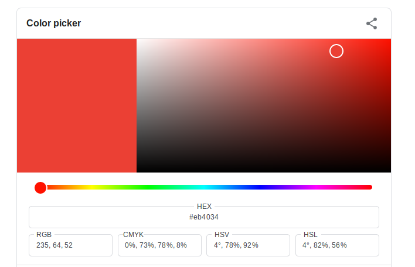

# Class 13: Forensics and Steganography

## Overview
In this lesson, we will introduce some topics in forensics. We will look specifically at steganography, how it works, some useful tools, and we'll solve some related CTF challenges.

## Forensics
In CTF, forensics challenges cover the following areas:
* Steganography
* File format analysis
* Memory dump analysis
* Network packet capture analysis
* Other forms of examining and extracting information from static data files


## Steganography
Steganography is the practice of hiding information within other non-secret data, usually images. The first recorded use of Steganography was in the ancient egyptians shaving a slaves head and tattooing an image on it until the hair grew back and then they sent him to wherever they wanted the message to go.

Nowadays, we have better ways to get secret messages to people. Image steganography using the least-significant bit (LSB) method is the most common, and there are a few tools that can help with decoding/decrypting steganography like this which we'll introduce in a little bit.


### Color Representation
Images are made up of colored pixels, and each pixel has red, green, and blue values, or RGB values. For example, (66, 135, 245) is a shade of blue, with a red value of 66, a green value of 135, and a blue value of 245. This could also be written in hex: #4287f5. Each red, green, or blue value is represented by a byte, or 8 bits, which means the value can span from 0 to 255.

>**Play around for a little bit with [this online color picker](https://www.google.com/search?q=color+picker). If I were to use only the RGB values that make up an image to hide a secret message, how would I do it?**




### Least-Significant Bit
What happens when we change the last bit of one of the red, green, or blue values? Do you a notice a change in the color? You cannot visibly tell whether the last bit was changed or not, so what if we use that last bit of every RBG value to hide our message? The last bit is known as the least-significant bit, and is the key to LSB steganography.

The first step is to convert whatever message we're hiding into a binary number:
``` python
from Crypto.Util.number import *

m = 'hello'
b = bin(bytes_to_long(m))
print b
>>> 0b110100001100101011011000110110001101111
```

Now we can break up the bits of our binary message across the RGB values for an image. For example, if the first pixel of an image has a red value of 120, or 01111000 in binary, we would change the last bit from a 0 to a 1, giving us 01111001 or 121 for our red value. Do the same for the green value and next bit of our message, the same for the blue value, and repeat for the next pixel.

Here's some Python code using PIL to encode an image using this method:
```python
from PIL import Image
from Crypto.Util.number import *
im = Image.open('hen.png')
values = list(im.getdata())
flag = "hello"
binary = bin(bytes_to_long(flag))[2:]
binary = (len(binary) % 8)*'0' + binary
                
values = [v for t in values for v in t]
def encode(values, binary):
    i = 0
    new_values = []
    for v in values:
        b = bin(v)[:-1] + binary[i]
        new_values.append(int(b, 2))
        i += 1
        if i == len(binary):
            new_values.extend(values[i:])
            return new_values
        
new_values = encode(values, binary)
it = iter(new_values)
new_values = zip(it, it, it)
im2 = Image.new(im.mode, im.size)
im2.putdata(new_values)
im2.save('lsb_steg.png')
```

#### Challenge: LSB
>**Solve the LSB challenge. I used the above python script to encode the flag in the given image.**

### [StegOnline](https://georgeom.net/StegOnline/upload)
Steg Online is one of the fastest and easiest tools around for image steg. My favorite part is the LSB half button. More on this later.

### Example 1
[Download this file](https://github.com/zelinsky/CTF-Course/blob/master/Forensics/Steganography/stego.png) and proceed to [this link](https://georgeom.net/StegOnline/upload) to try to find the hidden image inside this image!

### Example 2 
[Download this file](https://udctf.com/challenges#In-Class%20problem%201) and throw it in your [StegOnline](https://georgeom.net/StegOnline/upload) tool. This time I used Single LSB steg. Find the message and submit it under the [In-Class Problem 2](https://udctf.com/challenges#In-Class%20problem%202)

## Steganography Tools
* [StegOnline](https://georgeom.net/StegOnline/upload)
* [zsteg](https://github.com/zed-0xff/zsteg)
* [steghide](http://steghide.sourceforge.net/)
  * [Online version](https://futureboy.us/stegano/decinput.html)
* [stegsolve](https://github.com/zardus/ctf-tools/blob/master/stegsolve/install)
* [exiftool](https://sno.phy.queensu.ca/~phil/exiftool/exiftool_pod.html)
* [pngcheck](http://www.libpng.org/pub/png/apps/pngcheck.html)
