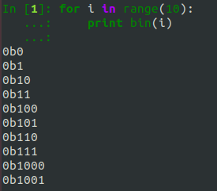
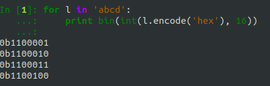
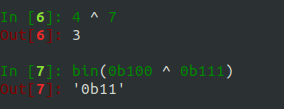
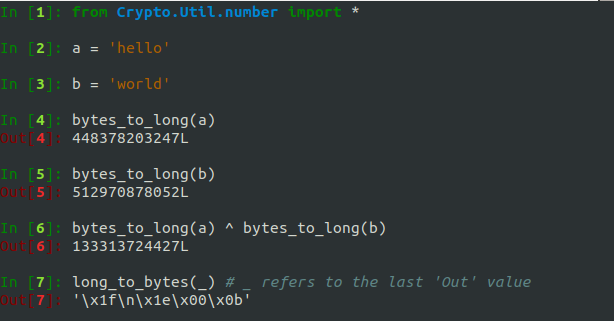
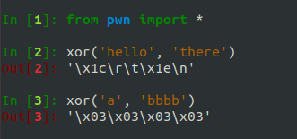

# Class 3: Binary, XOR, and the One-Time Pad

## Overview
The following exercises will help you undersand the binary behind all of the characters we use. You will also learn about a very important binary operation, XOR. We'll also look at an encryption scheme that uses XOR, the One-Time Pad, and we'll perform some attacks against some poorly encrypted strings.


## Binary
Everything represented on your computer is just stored as bits, 1s and 0s. Let's take a look at some binary numbers:



These are what the numbers actually are; everything else is just a lie. Even letters are just binary:



And to convert back to ASCII:


## XOR
With binary operators we can just deal with the decimal representations, but it's important to understand what's happening under the hood.

Here's a truth table for the binary XOR (exclusive-or) operation:

| A     | B     | A XOR B |
| ----- | ----- | ------- |
| 1     | 1     | 0       |
| 1     | 0     | 1	  |
| 0     | 1     | 1	  |
| 0     | 0     | 0	  |

And here's how to XOR two numbers in Python ('^' is the binary XOR operator in Python). Pay attenion to what is happening at the binary level:



>**Without coding it, what is 1100 ^ 0101? What about 8 ^ 11?**

Now, how do we XOR two strings? Well, we just have to convert them to numbers first! We saw in the previous exercise how to do this, but there is an easier way using the pycrypto Python module. We can also convert from the number back to the bytes:



>**Convert "UDCTF" to an integer and XOR it with the number 30249328405. What is the result in ASCII?**

Now, you have everything you need to write your own XOR function that takes in two strings and returns the XOR of them. If you want to attempt this, it would be a great coding exercise, but I'm going to show you a quick and easy-to-use XOR function from **pwntools**:



The pwntools xor function will cycle the shorter string over the longer one.


## Transformations
So far, we've seen a few ways to represent strings:
* ASCII
* Integer
* Hex Digest

And we'll add one more:
* Byte Array

A byte array of a string is just an array of the ordinal values of the characters. For example, they byte array of **"abc"** is **[ord('a'), ord('b'), ord('c')]**.

It's very important to be able to convert between these formats:
```python
# These are the 12 1-line transformations that are most useful to crypto CTF problems

#THIS IS THE PYTHON 2 VERSION
#in every CTF or crypto session this line is my first include
from Crypto.Util.number import *

#Our four formats are plaintext (ASCII), hex digest, integer, and byte array
pt="this is plaintext"

#1) ASCII to HEX
hexdigest = pt.encode('hex')
#2) HEX to ASCII
hexdigest.decode('hex')

#3) ASCII to Integer
int_pt = bytes_to_long(pt)
#4) Integer to ASCII
long_to_bytes(int_pt)

#5) Integer to hex
format(int_pt, 'x')
#6) hex to Integer
int(hexdigest, 16)

#7) ASCII to byte array
pt_as_bytes = map(ord, pt)
#8) byte array to ASCII
"".join(map(chr, pt_as_bytes))

#9) byte array to hex
"".join(map(lambda x: hex(x)[2:], pt_as_bytes))

#10) hex to byte array
[int(hexdigest[i:i+2], 16) for i in range(0, len(hexdigest), 2)]

#11) byte array to int
bytes_to_long("".join(map(chr, pt_as_bytes)))

#12) int to byte array
map(ord, long_to_bytes(int_pt))
```


## Challenge: Numbers 2
>**Complete the Numbers 2 challenge using everything you've learned so far this class.**


## One-Time Pad

### Why XOR is Awesome
XOR is great for cryptography for two reasons:

**1. XOR preserves randomness**

If I XOR a patterned string of bits 1111000011110000 with a random string of bits 1001110101000110, I get something that looks random: 110110110110110. Why is this?

For each bit in my random string, if there is a 50/50 chance of it being 0 or 1, then the output also has a 50/50 chance of being 0 or 1. If 1 is my input then 1 ^ 1 is 0 and 1 ^ 0 is 1. If my input is a 0 then 0 ^ 1 is 1 and 0 ^ 0 is 0. Either way I've got the same random distribution as what I XOR with.

**2. A XOR A is 0**

This may not seem that exciting at first, but this basically allows us to reverse an XOR operation.

**(A XOR B) XOR A is B**

If we XOR A with B, and then XOR the result of that with A again, the A's "cancel out" (since A XOR A is 0), and we're left with B.

>**Verify this for yourself. Take the XOR("hello", "world"). Now take the result of that and XOR it with "world" again.**


### Encryption Scheme
Encryption schemes are often described by three algorithms, GEN the key generation algorithm, ENC the encryption algorithm which consumes a key and a message and returns a ciphertext, and DEC a decryption algorithm which consumes a ciphertext and a key and returns the plaintext message.

GEN: choose a random key uniformly from {0,1}<sup>ℓ</sup> (the set of binary strings of length ℓ)

ENC: given k∈{0,1}<sup>ℓ</sup> and m∈{0,1}<sup>ℓ</sup> then output is c:=k XOR m

DEC: given k∈{0,1}<sup>ℓ</sup> and c∈{0,1}<sup>ℓ</sup>, the output message is m:=k XOR c

In words: take a random sequence of 0s and 1s as the secret key. XOR that key with your message to get the ciphertext. To recover the message, XOR the ciphertext and the key.

This is the _perfect_ encryption scheme...theoretically. If used incorrectly, say if the key is not random, or the length of the key is less than the length of the message, or the key is used multiple times, everything breaks.


## Approaches
Ask yourself the following questions while solving the problems:
* What do I have? Do I have the plaintext, the ciphertext, or the key?
* What do I need? How can I get from what I have to what I need? What operations can I perform?
* Is there anything that stands out or seems "wrong"?
* Is there anything I can infer (like, does the plaintext contain UDCTF)? i.e. **GUESSING**
* Is the search space small enough to brute force?

## Challenges
* The Key - Do you know how XOR works?
* The Lock - What if the key is used more than once?
* All The Single Ladies
* XOR ROX
* XORientation
* haXOR

