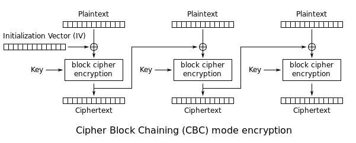
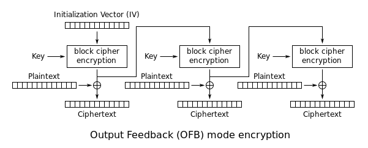
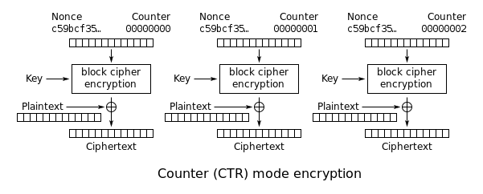

# Class 4

## Overview
In this lesson, we'll cover block ciphers and different block cipher modes. We'll also take a look at some attacks against poorly implemented block ciphers.

## Block Ciphers
Block ciphers will take in a message of a fixed-length, your private key, and they produce a ciphertext of that length. Block ciphers like AES and DES are examples of symmetric key encryption, meaning the same key is used for encryption and decryption, where asymmetric encryption schemes like RSA use a different key for encryption and decryption. 
```python
from Crypto.Cipher import DES

key = '12345678' 			# Key must be 8 bytes (64 bits) long with DES
cipher = DES.new(key, DES.MODE_ECB)	# Create a DES cipher with my key

ct1 = cipher.encrypt('abcdefgh')	# DES will encrypt 8 bytes at a time
print repr(ct1)
>>> '\x94\xd4Ck\xc3\xb5\xb6\x93'

ct2 = cipher.encrypt('abcdefgh')	# The same 8 bytes will always encrypt to the same thing
print repr(ct2)
>>> '\x94\xd4Ck\xc3\xb5\xb6\x93'

ct3 = cipher.encrypt('hgfedbca')	# Different bytes will encrypt to different things
print repr(ct3)
>>> 'KKX\x8d\x86\xa4f]'

ct4 = cipher.encrypt('abcdefghabcdefgh')# What is we give it more than 8 bytes?
print repr(ct4)
>>> '\x94\xd4Ck\xc3\xb5\xb6\x93\x94\xd4Ck\xc3\xb5\xb6\x93'

ct5 = cipher.encrypt('abcdefghhgfedbca')
print repr(ct5)
>>>'\x94\xd4Ck\xc3\xb5\xb6\x93KKX\x8d\x86\xa4f]'
```

Look at **ct4** and **ct5** above. They show the essence of what a block cipher is. Block ciphers encrypt a **block** of data at a time. For DES, the block size is 8. You can check this with `DES.block_size`. For ct4, the first 8 bytes that are encrypted are 'abcdefgh', and the next 8 bytes that are encrypted are also 'abcdefgh', so for the output we get 8 encrypted bytes followed by the exact same 8 encrypted bytes. 

In other words, if `x`, `y`, and `z` are 8-byte strings, then `DES_encrypt(x+y+z) == DES_encrypt(x) + DES_encrypt(y) + DES_encrypt(z)`. This is only true for **Electronic Codebook** mode, or **ECB**, a block cipher mode. Block cipher modes define *how* multiple blocks are handles. In ECB mode, each block is just encrypted seperately. This is the weakest mode, and you might have some intuitation as to why. The same plaintext blocks will map to the same ciphertext blocks (when using the same key). This is sort of like a substitution cipher, but with blocks instead of single characters, and is susceptible to attacks.


## Challenge: Blocky
>**Talk to your neighbors about how to solve the Blocky challenge without coding anything yet. Okay, now code it and get the flag.**


## AES
DES is pretty weak. For one, the key length is too small when you consider the power of today's computers. DES also has some other weaknesses that we'll revisit later.

The block cipher to use is AES. The main difference between AES and DES that you should know for now is that the block size for AES is 16 bytes, and the key is either 16, 24, or 32 bytes long.

AES hasn't been broken, yet, so challenges involving AES involve errors in implementation (poorly chosen keys or IVs), not the cipher itself. Occasionally challenges may feature a custom implementation of AES with a poorly chosen SBOX, which require some differential analysis and knowledge of AES internals. However, those challenges are rare, so for now we can treat AES encryption in ECB mode as a black box, and focus on weaknesses in key/IV choices for the specific mode of AES encrpytion. 
```python
from Crypto.Cipher import AES

key = 'thisisasecretkey' 			# Key must be either 16, 24, or 32 bytes
cipher = AES.new(key) 				# Default mode is ECB (same for DES)

ct1 = cipher.encrypt('abcdefghijklmnop')	# AES encrypts 16 bytes at a time
print repr(ct1)
>>> '5\xe0\xce[\x9d\xea\x1c=\xbd\xfbz;L\xa5\x02t'

ct2 = cipher.encrypt('abcdefghijklmnop'*2)	# ECB mode at work
print repr(ct2)
>>> '5\xe0\xce[\x9d\xea\x1c=\xbd\xfbz;L\xa5\x02t5\xe0\xce[\x9d\xea\x1c=\xbd\xfbz;L\xa5\x02t'
```

## More Block Cipher Modes

### Cipher Block Chaining (CBC)


For CBC mode, the first step is to generate a random initialization vector (IV) of 16 bytes.

Next, XOR the IV and the first 16 bytes of your plaintext to get input for AES.

That creates the first 16 bytes of the ciphertext (often the IV is sent as the actual first 16 bytes). These first computed ciphertext bytes become the IV for the next block of plaintext, and repeat.

```python
from Crypto.Cipher import AES
import os
from pwn import xor

key = 'asupersecretkey!'
iv = os.urandom(16)		# IV must be 16 bytes too!
print iv.encode('hex')
>>> 2fcb848b15ebf54c21b1fe8cc76a1f75

cbc = AES.new(key, AES.MODE_CBC, iv)
ct1 = cbc.encrypt('abcdefghijklmnop' * 2)
print ct1.encode('hex')
>>> 67f6b474948976ae67597d6f8ebf8ac128f58872b7a9a58ce833e50be5373742

ecb = AES.new(key, AES.MODE_ECB)
block1 = ecb.encrypt(xor(iv, 'abcdefghijklmnop'))
block2 = ecb.encrypt(xor(block1, 'abcdefghijklmnop'))
ct2 = block1 + block2
print ct2.encode('hex')
>>> 67f6b474948976ae67597d6f8ebf8ac128f58872b7a9a58ce833e50be5373742
```
### Mini-Challenge: Lost IV
Oh no, I lost my IV, and I could only recover part of my key since the last two bytes were unprintable characters! Can you help me recover at least a small portion of my plaintext. 

partial-key: SuperSecretKey
ciphertext = d8ba9167c429b98c774ee438612e943a6d422d0e32fdcb0c1eb0efc300a13a55

### Challenge: Redacted
>**Solve the Redacted challenge.**


### Output Feedback (OFB)



### Challenge: Weak Keys
>**Solve the Weak Keys challenge.**


### Counter (CTR)

