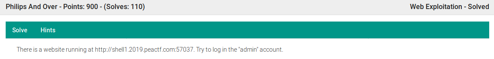
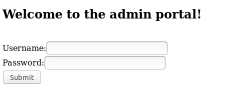
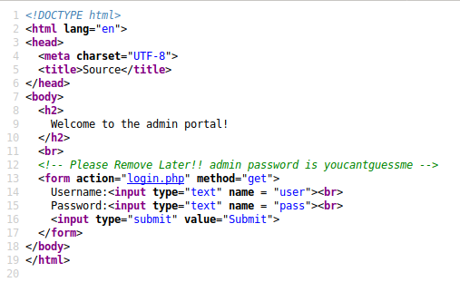
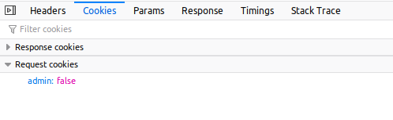
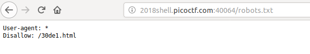

# Class 6: Web Intro

## Overview
This lesson will serve as an introduction to web challenges. We'll go over how to approach web challenges, common things to look for on websites, and some other web basics. We'll also introduce some web topics that we'll dive deeper into later.


## Intro to Web
Web challenges cover such a wide array of different topics, exploits, and general trickery that is often difficult to know where to start. Some may think that web challenges are all about guessing things, but there's more to it than that.

Designers of web challenges will usually have some sort of roadmap in mind for the challenge, a thought process that leads from the initial discovery of *something* to the flag.

Your job is to find and follow that roadmap. You need to make that initial discovery, and follow it. Try things, note what happens, adapt or try something new, and repeat. Most things are there for a reason, and the simplest solution is often the right one. Web challenges are a lot more like solving puzzles than guessing.


### Challenge: Dora the Explorer
>**Now go explore! Solve the Dora the Explorer challenge. Do not look below until you have attempted it!**


### Places to Look

1. The challenge title and description
  * Pay attention to the title and description. Some web challenges can be pretty straightforward. The description may tell you exactly what you should be trying to do, e.g. "login as admin", or the title may reference a language or exploit, e.g. "SQL is Hard", "My Little PHPony", or "Caesaref".



* The web page
  * This is a pretty obvious one: just look at the website! Follow any links you see, enter input into forms, and see what happens. Again, if the challenge is straightforward, you'll be able to tell what your next step is just by looking at the website. Is it just PHP code that is processing my input somehow? Is it a login page? What if I try a common login like "admin" and "password"? Is it a forum where I can make posts?



* The source
  * The first "hidden" place to look is the source code. **Right-click on the page and select _View Page Source_** to look at the source. Look for any comments `<!-- this is an HTML comment -->`, forms, or javascript functions. Figure out what the page is doing. If you see any references to other files on the web server, follow those references, and see if you can access the directory that they're in. For example if in the source I see ``, it might be a good idea to see if I can access _website.com/images_ or even to see if _website.com/images/pic2.jpg_ exists.



* Headers and cookies
  * Another place to look at is the headers and cookies. To do this, **right-click on the page, select "Inspect Element", navigate to the "Network" tab, and select web page**. From there, you can see the request and response headers, and you can also look at cookies and parameters. Do the cookies contain any information? Is there a "PHPSESSID" or "csrf-token" cookie?




* Common files and directories
  * /robots.txt
  * /.git/HEAD
  * /admin(.php)
  * index.php




## Tool: Curl
We're going to introduce one tool to you today, curl. Curl is a command-line tool, and this is the simplest way to use it:

```shell
curl http://www.website.com
```

>**Run this in your terminal: 'curl http://udctf.com:5000/'. What do you get?**

Curl is used to make requests to web servers and receive responses. That's essentially what your web browser does, except your web browser interprets all the code and makes it look pretty. So why use curl (or something similar)? Well, sometimes we have to.

### Challenge: Curling
>**Solve the Curling challenge. Hint: you'll have to use curl.**

### Examples
```shell
# Curling multiple files
curl http://www.website.com/flags/flag[1-100]

# Setting cookies
curl http://www.website.com -b "admin=true"
curl http://www.website.com -H "Cookie: admin=true"

# POST request with url encoded data
curl -X POST http://www.website.com -d "user=admin&password=password"

# POST request with json data
curl -X POST http://www.website.com -H "Content-Type: application/json" -d '{"key1":"value1", "key2":"value2"} 
```

Curl is just one web tool at your disposal. There are many more tools we can use to help us solve web challenges, and we'll take a look at a few in later lessons.
