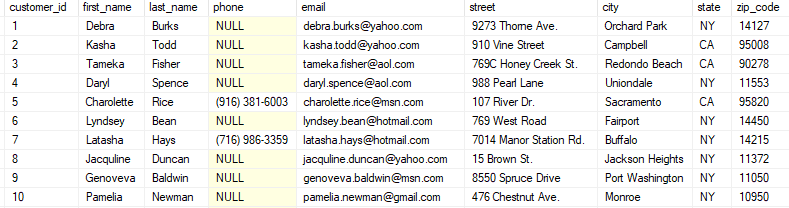

# Class 7: SQL and SQL Injection

## Overview
In this lesson, we will get you familiarized with SQL commands. Then, we will go over how to inject those SQL commands into vulnerable web services.

## SQL

### Overview
SQL, or Structured Query Language, is used to communicate with a database. A database is a collection of data that is organized into tables. There are other apsects to databases, but most of the time we'll be dealing with tables only. Here is an example of a table called CUSTOMER:



The CUSTOMER table is composed of columns (or fields): customer\_id, first\_name, last_name, and so on.

Each row is a record in the table. A record is composed of fields (the columns) that contain data about a particular item. For example, the first entry or record in the table has a customer\_id of 1, first\_name of Debra, last\_name of Burks, and so on.

SQL is how we interact with the tables to either insert into or select from them.
## Practice SQL commands in sqlite3
Download this database which has most of the scrabble dictionary words. 
[scrabble.sqlite](examples/scrabble.sqlite) 

```shell
sudo apt-get install sqlite
```

To open the database:
```shell
sqlite3 scrabble.sqlite
```

Useful Sqlite commands:
```sql
-- Show all tables
.tables

-- Show table struture
PRAGMA table_info(table_name);
```

Now try running: 
```sql
select words from racks where rack="AENORST"
```

Now what command would you run to get all anagrams of "PIRATES" from the db? 

Also how would we get all of the anagrams of "PIRATES" of length 4? 

Here are some other examples:
```sql
-- Select all rows and columns from CUSTOMER table
SELECT * FROM CUSTOMER;

-- Select data in columns 'first_name' and 'last_name'
SELECT first_name, last_name FROM CUSTOMER; 

-- Select data in column where certain conditions are true
SELECT email FROM CUSTOMER WHERE first WHERE first_name = 'Kasha' AND last_name = 'Todd';
SELECT phone from CUSTOMER WHERE last_name = 'Rice' or last_name = 'Hays';
SELECT city FROM CUSTOMER WHERE customer_id > 8;
SELECT zip_code FROM CUSTOMER WHERE first_name LIKE '_e%'; -- _ is a single character; % is zero or more characters
```

[Here is a cheat sheet with more SQL commands and examples.](http://www.sqltutorial.org/sql-cheat-sheet/)

### Challenge: LEAKED_DB
For this challenge, you will need to install Sqlite to interact with the database:
>**Solve the INTRO_TO_SQL challenge.**

## SQL Injection
Many login pages submit your username and password (or hash of your password) that you provide as a SQL query that looks something like this:
```sql
SELECT * FROM USER WHERE user=your_username AND password=your_password;
```

and vulnerable login pages will do something stupid like this to get your input:
```php
$user = $_POST['username'];
$pass = $_POST['password'];

$sql = "SELECT * FROM login WHERE User='$user' AND Password='$pass'";
```

Your input isn't sanitized at all, and you can mess around with the SQL query in all sorts of ways! Try it out in the challenge below!

### Challenge: SQLi
>**Solve the SQLi challenge.**


## Blind-SQL Injection 
>**Go over peaCTF challenge** 
