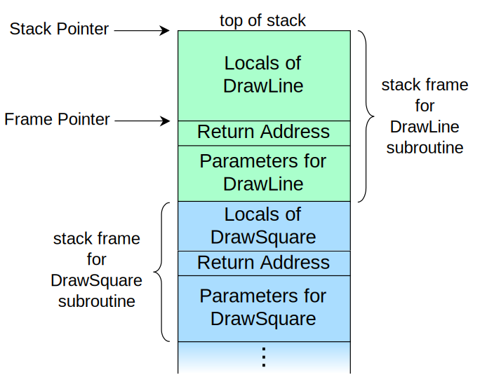

<head><link rel="stylesheet" type="text/css" href="gist.css"></head>

# Class 8: C and Assembly

## Overview
In this lesson, we will look at some code written in c and assembly. We will also write our own basic C programs, compile them, and then disassemble them in order to look at the assembly code and compare it to the original c code.

## Introduction to C
C is a statically typed language, meaning variable types are known at compile time. C leaves a lot open to the interpretation of the programmer, allowing unspecified and undefined behaviors of the program, making it prime for exploitation. However, C is very fast and has been used to solve Crypto challenges in 3 minutes in what would take 30 minutes in python. 

Here's a first program in C that utilizes loops, branching, function definitions, etc. so you can familiarize yourself with the language.

<script src="https://gist.github.com/zelinsky/97351395abdd0e29597724bc77b5cfaf.js"></script>

To compile this program with `gcc`, in the command-line type: 
```shell
gcc -o hello_c hello_c.c
```
To run the program: 
```shell 
./hello_c arg1 arg2 arg3 
```

Now run the `file` command on the executable: 
```shell
file hello_c
```
The output should look similar to this: 
```shell 
hello_c_64: ELF 64-bit LSB pie executable, x86-64, version 1 (SYSV), dynamically linked, interpreter /lib64/ld-linux-x86-64.so.2, BuildID[sha1]=01794360e372ee31ebd2ac56833e93656d0af3c9, for GNU/Linux 3.2.0, not stripped
``` 
Most computers nowadays are 64-bit, and your executable is most likely a 64-bit executable, but to make getting started with x86 assembly a little easier, we'll be dealing with 32-bit programs. In order to do this we have to install the `gcc-multilib` package. 
```shell 
sudo apt-get install gcc-multilib 
```

The code can now be compiled into a 32-bit executable with the `-m32` flag: 
```shell 
gcc -m32 -o hello_c hello_c.c
```
Running the `file` command ... 
```shell
file hello_c
``` 
... should now have output similar to this. 
```shell 
hello_c: ELF 32-bit LSB pie executable, Intel 80386, version 1 (SYSV), dynamically linked, interpreter /lib/ld-linux.so.2, BuildID[sha1]=2c58cf5e73cbc640517117fa3c668bc460b24f65, for GNU/Linux 3.2.0, not stripped
```

## Arrays, Malloc and Free, Pointers and Pointer Arithmetic
Arrays in C can be allocated on the stack or on the heap. When arrays are allocated on the stack, the memory remains allocated until the end of the scope of the function or until the program terminates. When arrays are allocated on the heap, the programmer decides when to deallocate the memory, or if they forget it's deallocated at the end of the program. Forgetting to deallocate memory causes poor performance because the memory cannot be used until it is freed up. 

Here is an example of allocating space for an array of 10 integers on the stack:
```C
int arr[10]; // arr points to the first integer
```

When allocating memory on the heap, the `malloc()` function is used. The programmer must specify the number of bytes needed in the malloc call, and malloc returns a pointer to a contiguous chunk of memory that is the requested size. To find the size, in bytes, of a C-type, use the `sizeof()` function. Here's an example of allocating space for an array of 10 integers on the heap. 
```C 
int *arr = malloc(10 * sizeof(int)); // arr points to the first integer
``` 

#### Pointers
Pointers in C are a data type that contain the address of a memory location. Pointers can be declared with: 
```C 
int* p; 
``` 
p now has type pointer-to-int. 
We can assign p a memory address by doing: 
```C 
p = (int *)malloc(sizeof(int)); //don't forget to free!
```
or 
```C 
int x = 7;
p = &x; 
``` 
The `&` operator means the address of the variable. So if a variable `t` has type T, then `&t` has type pointer-to-T. 

One can find the value stored at a pointer by using the `*` operator, which dereferences the pointer. 
```C
int y = *p; //y is assigned to the integer stored at pointer p
```

#### Pointer Arithmetic
Suppose we have an array `arr1`. We can access the element at index 1 of `arr1` with `arr1[1]`, but we can also use pointer arithmetic. `arr1` is really just a pointer to an int. It stores the memory address of the first integer of the array. Looking back at the dereference operator, `*`, `*arr` is the value stored at that memory address, or the first element of the array, and is equivalent to `arr[0]`. We can access other elements of the array this way too. `arr+1` is the address of the second integer of the array, and `*(arr+1)` is the value of that integer. Again, `*(arr+1)` is equivalent to `arr[1]`. In general `*(arr+n)` is equivalent to `arr[n]`.

Here's an example:

<script src="https://gist.github.com/zelinsky/dc097da4712e966ff1c4dd4ae8db73dd.js"></script>

Adding n to a pointer-to-T, where T is a type, increments the pointer by n times sizeof(T). 


## x86 Syntax and Registers 
Registers are basic storage units inside the CPU. 
In x86 Assembly, instructions involve opcodes (function to be performed), registers, and constants (integer values). 
Instructions generally take the form: 
> OPCODE [DESTINATION REGISTER / CONSTANT], [SOURCE REGISTER / CONSTANT] 

Moving Data: 


mov ebx, eax
> Move the value in eax to ebx

mov eax, 0xDEADBEEF
> Move 0xDEADBEEF into eax

mov edx, DWORD PTR [0x41424344]
> Move the 4-byte value at address 0x41424344 into edx

mov ecx, DWORD PTR [edx]
> Move the 4-byte value at the address in edx, into ecx

mov eax, DWORD PTR [ecx+esi*8]
> Move the value at the address ecx+esi*8 into eax


Arithmetic: 

sub edx, 0x11
> edx = edx - 0x11; // subtracts 0x11 from edx

add eax, ebx
> eax = eax + ebx; // add eax and ebx, storing value in eax

inc edx
> edx++; // increments edx

dec ebx
> ebx--; // decrements ebx

xor eax, eax
> eax = eax ^ eax; // bitwise xor eax with itself (zeros eax)

or edx, 0x1337
> edx = edx | 0x1337; // bitwise or edx with 0x1337


Conditional Jumping:
Jumps are how we change program execution based on conditions (for branching and loops) 

See hello_c in assembly for a better understanding

<b>BYTEs, WORDs, and DWORDs</b> 
* bytes - 8 bits 
* word - a word is 16 bits (or 2 bytes)
* dword - double word is 32 bits ( or 4 bytes) 

 
    
## Radare2 
To open a binary in Radare2 run. The d flag opens it in debug mode and the A flag runs extra analysis on the binary. This opens Radare2 in command mode. 
> r2 -Ad binary_name

The most common entry point function names for a binary are main and start, so we can run s main (or s start if that fails) to find the main functionality of the program. 
> s main 

Now, to see the assembly in Radare2, we need to switch from command mode to Visual mode and cycle to the Assembly syntax. V opens the binary in Visual mode, and p cycles through the different views. To get to the assembly in one line in command mode, we type 
> Vpp 

To scroll up and down in Radare2, use the j key to scroll down and the k key to scroll up. 

We can run commands in Visual Mode by typing a colon and your commands 
> : [insert commmands here | s main] 

When we are reversing programs it's helpful to set breakpoints in certain parts of the code and examine the register values at that breakpoint. 
These commands can be run in command mode

We can set breakpoints with: 
> db address_here 

We can list breakpoints with: 
> db 

We can continue [or run] a program with dc, which runs the program until the program ends or the next breakpoint
> dc 

When our program hits a breakpoint, we can see the values of our registers with drr. 
> drr 

We can also access values at specific offsets from the registers with 
> px num_bytes_to_view @[esp + offset] 

To see the local variables of a function type 
> afvd 


## EBP, ESP, and Stack Frames
EBP - the Base Pointer (refers to the base of the stack), stays constant within a stack frame 
ESP - the Stack Pointer (points to the top of the stack), varies throughout the stack frame to adjust for local variables

When a function is called, the calling function's base pointer is pushed to the stack, to preserve the base pointer of the calling function and the stack pointer is moved into the base pointer. 

You will see something like this in the assembly: 

```assembly 
push ebp 
mov ebp, esp
```

Then room for the local variables (which are offsets from the base pointer) is made by adjusting the stack pointer. 

You will usually see a call like: 
```assembly 
sub esp, 0x40 ;; we subtract from the stack pointer to make room because the stack grows down
```


## x86 Calling Conventions 
In C we might have a function called myFunc that looks like: 
```c
int myFunc(int a, int b, int c){ 
	/** 
	Do stuff here
	**/ 
} 
```
And then in main we will call the function like: 
```c
myFunc(1, 2, 3); 
```
In x86, the arguments to myFunc are passed via the stack and are pushed in order of the arguments from right to left. 
```assembly
push 3
push 2
push 1
```

## Reversing our First Crackme's

<script src="https://gist.github.com/zelinsky/dfb84a45012907b458995dd1a34968f9.js"></script>
