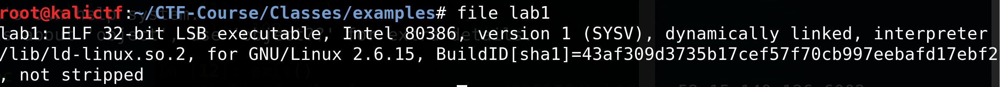
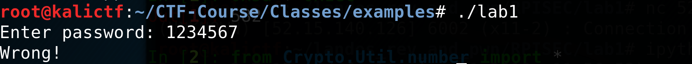
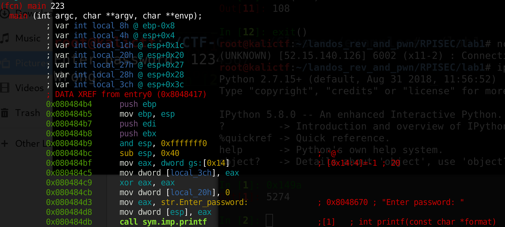
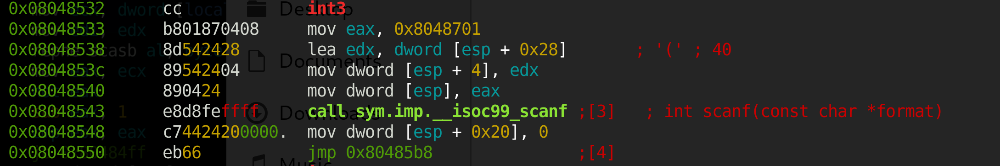
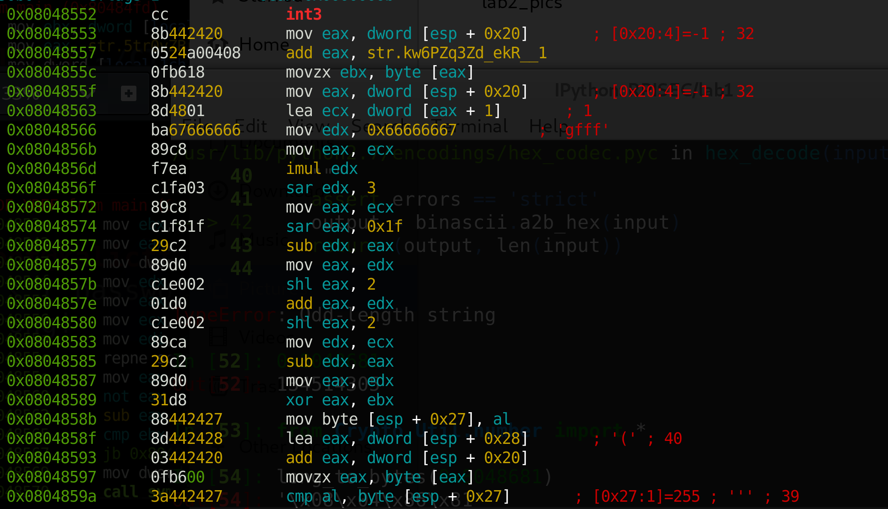

# Reverse Engineering Practice 

## Overview
In this lecture we will run through a few reversing problems and begin creating a problem solving strategy for reversing problems. 

# Lab1 
You can download the program [here](examples/lab1).

In order to make the program executable run `chmod +x lab1`. 

Before we run our program, it's a good practice to run `file` on our program to see any interesting properties of our executable. 
 

This is just a normal 32-bit ELF file that we have seen in the previous class. 

Now let's execute our program to get a basic idea of how the executable should function. 
 

This program asks for a password, which we gave `1234567`, which receives the output `Wrong`. We are looking for functionality that will evaluate our input in some password checker. 

Now let's open the executable in Radare2 with `r2 -Ad lab1`

After running `s main` and switching to Visual Mode with `Vpp`, Radare2 should look like 


In order to find the password, we are looking for how this program compares our input in some function. This initial view is just preparing the stack for local variables, and printing `Enter password: `, so we can ignore this part of the function. 

As we scroll down, we'll notice a call to scanf, which is where the program gets our input. Let's look at a few instructions before the call to scanf to find where our input is being stored. 
 

We see a call to `mov eax, 0x8048681`, and a few instructions later we see `mov dword [esp], eax`. These two instructions load the first argument to the scanf function, which is the format specifier '%s', since our program is looking for a string as input. 

Then, our second argument (the address our input will be stored at) to scanf is loaded by `lea edx, dword [local_28h]` and `mov dword [local_4h], edx`. The lea instruction stands for `Load Effective Address`, so that instruction loads the address of local_28h into edx. 

So now, we know our input is going to be in local_28h after the call to scanf. 

Next we see a local variable is initialized to 0, and then an unconditional jmp to an address. So let's go to that address, and see what is happening. 
 

This part of the code is a little intimidating at first because I had never seen the `repne scasb` instruction. 

But it turns out we don't need to know what that instruction does at all. 

This section of the assembly doesn't reference local_28h (where our input is) at all, and doesn't use local_20h until the call to `cmp`, so the `eax` register value will always be same. So let's set a breakpoint at the address of the `CMP` call and see what that value of `eax` is. 

In the Radare Console type: 
> db [address-of-CMP-call] 
> 
> dc 

When the prompt says `Hit breakpoint at [insert address here]`, type `dr` and search for the `eax` register in the output. 

The value should be `0x11` which is 17 in decimal. That looked very close to the length of the string that was loaded earlier in this section, so I checked that the lengths were the same. So all that section does is compare `local_20h` to the length of the string. Then `jb` is `jump if below`, so if the result of the compare is below, we jump into a loop, otherwise we get success printed. 

We can conclude that `local_20h` is our loop counter. 

Now let's look at that loop. 
 

The first three instructions load `local_20h`<sup>th</sup> byte into the edx register. 

`mov eax, dword [local_20h]`
> Loads the loop counter into eax

`add eax, str.5tr0vZBrX:xTyR_P`
> Adds the address of the string from memory 
> 
> Now eax is the address of the `local_20`<sup>th</sup> byte 

`movzx edx, byte [eax]`
> movzx stands for move zero-extend, so it pads with zeros until number being moved in fills up the size of the register it's going in
> 
> so we are moving the byte stored at eax into edx, which is the `local_20`<sup>th</sup> byte of the string

Then our loop counter is loaded into `eax`, and `eax` is xor'ed with `edx` and the output is stored in `eax`. 

Then we see the `mov byte [local_27h], al` instruction. `al` is the last byte of the eax register, so the result of the previous xor instruction is loaded into `local_27h`. 

Now we **finally** see our input used with `lea eax, dword [local_28h]`, which loads the address of first byte of our input into eax. 

The next instruction is `add eax, dword [local_20h]`, which gets the `local_20h<sup>th</sup>` byte of the input string. 

Then we see `cmp al, byte [local_27h]`, which compares our input to the xor'ed parts of the string. 

If the result of the compare is equal, we increment local_20h, and keep moving, otherwise it prints wrong. 

So now we have everything we need to get the password. The input password is the result of xoring the i<sup>th</sup> character of `str.5tr0vZBrX:xTyR_P` with i. 

Let's copy our string and move this into python. 

One way this can be done in python is
 

Now we throw our password into the binary to make sure we are correct.
 


# Lab2 
You can download the binary [here](examples/lab2) 

So we run `file lab2`, `chmod +x lab2`, and `./lab2`, and we realized that `lab1` and `lab2` function very similarly, we need to find the correct password. 

Then we open `lab2` in Radare2, and it still looks mostly the same up until before the `scanf` function call. 
 
One of the first things to notice is the `int3` call. 
> This call causes a interruption in execution when the program is opened in a debugger. This is essentially a breakpoint set for you in the
> 
> program. 

Also now our input will be stored in `[esp + 0x28]` instead of `local_28h` this time, and our loop counter is stored at `[esp + 0x20]` instead of `local_20h`.

Then our program `jmp`'s to the section where it compares `[esp + 0x20]` to the length of the string (just like `lab1`), and then it jumps into the interesting section of the loop. 
 
We have a another `int3` instruction, setting another breakpoint in our program. 

The next three instructions store the first byte of a string in memory in ebx, similar to `lab1`. 

Then the next two instructions, load `[esp + 0x20]` + 1 into ecx, and `[esp + 0x20]` is our loop counter. 

So it runs `mov eax, dword [esp + 0x20]`, which stores the 4-byte value at `esp + 0x20` in `eax`. 

Then it runs `lea ecx, dword [eax + 1]`, which loads the address of the 4-byte value stored at `eax + 1`, which is `eax + 1`. 

Then a bunch of weird instructions happen (we'll come back to these) that modify eax, until we get to `xor eax, ebx`. 

Then, like in lab1, we compare the `[esp + 0x20]<sup>th</sup>` value of our input to the value at `esp + 0x27`, and if they aren't equal, it tells us we're wrong. Otherwise it goes to the next byte. 

So, we can set some breakpoints, and see what values are being compared to our input and `[esp + 0x27]`. 

In radare2 command mode type: 

> db [address of compare instruction] 
> 
> dc (you might have to type this a few times until you get to your breakpoint because of int3's) 
> 
> ps 1 @esp + 0x27 (run this at the breakpoint) 
>  

The last command prints the 1 byte string stored at esp + 0x27. The output should be `j`. 

Then we xor that output with the first byte of the string stored in the program to recover the first byte of the key. 

```python 
ord('j') ^ ord('k') 
>> 1 
```

Then we repeat the process to get the next byte, and we get 2.

So I assumed that the next part of the key would be 3, and so on. 

```python 
result = "" 
for i in range(len(string)): 
    result += chr(ord(string[i]) ^ (i + 1)) 
```
And this gives us the password without even knowing how those numbers were obtained. 

But, what if this generation of the key wasn't so predictable? 

We should still try to reverse it anyway. 

Since we know the values of ecx will just be the values of `esp + 0x20` plus 1, we can write an equivalent loop in python that does the assembly instructions for us. But first, we need to know what `imul`, `sar`, and `shl` do and how we can get their functionality in python. 

`sar` and `shl` are bitwise operations like `xor`, `and`, and `or`. 

`sar` stands for Shift-Arithmetic Right. It shifts all of the bits to the right while preserving the sign of the original argument. `sar eax, 2`, performs 2 bit-wise shifts right on the eax register. This is equivalent to dividing by pow(2, 2). 

in python 
```python 
eax = 64 
eax = eax >> 2
>> 16
```
`shl` stands for Shift-Logical Left. This shifts all of the bits to the left, padding with zeroes on the left. `shl eax, n` performs n bit-wise shifts to the left on the eax register. This is equivalent to multiplying by pow(2, n). 
```python 
eax = 64 
eax = eax << 2 
>> 256
```

`imul` is signed multiplication. With a single operand, it multiplies the operand with the `eax` register. Since we are dealing with two 32-bit registers, we aren't guaranteed that our result will be 32-bits. To compensate for that, imul stores the 32 most significant bits in the register that's the operand, and the 32 remaining bits in `eax`. 

```python 
def imul(eax, edx):                   
    mult = eax * edx 
    mult = bin(mult)[2:] 
    mult = '0'*(64 - len(mult)) + mult 
                       
    edx = mult[:32]
    eax = mult[32:]   
    return (int(eax, 2), int(edx, 2))
```

Now we have everything that we need to reverse the key that's being xored with the string. 

```python 
string = 'kw6PZq3Zd;ekR[_1' 
for ecx in range(1, len(string) + 1): 
    edx = 0x66666667
    eax = ecx 
    eax, edx = imul(eax, edx) 
    edx = edx >> 3 
    eax = ecx 
    eax = eax >> 0x1f 
    edx = edx - eax 
    eax = edx 
    eax = eax << 2
    eax = eax + edx 
    eax = eax << 2  
    edx = ecx 
    edx = edx - eax 
    print(edx)

```

# Bombs 
Download the Bomb [here](example/bomb)
